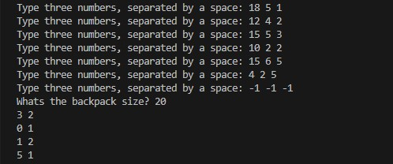

# **Knapsack Problem Solver**

This GoLang program solves the 0/1 Knapsack Problem using a greedy approach. It sorts the given items based on the ratio of value to weight in a non-increasing order and selects items to maximize the total value while considering the knapsack's weight capacity.

## **How to Use**

1. Ensure you have GoLang installed on your system.
2. Run the following command to execute the program:
   ```bash
   go run main.go
3. Follow the prompts to input item information and knapsack capacity.

## **Functions**

### `selectionSortDecrescente`

This function implements a selection sort algorithm to sort the items based on the value-to-weight ratio in a non-increasing order.

### `getInput`

This function prompts the user to input three numbers and returns them. It's used to gather information about the items.

### `min`
This utility function returns the minimum of two integers.

### `main`
The main function of the program. It collects information about the items, sorts them, and selects the items to fill the knapsack while maximizing the total value within the weight capacity.

## **Performance**

The performance of the program primarily depends on the number of items and the knapsack's weight capacity. Here's a brief overview:

- **Time Complexity**: The time complexity of the program is primarily determined by the selection sort algorithm, which has a worst-case time complexity of O(n²) where n is the number of items. The overall time complexity is dominated by the sorting operation.

- **Space Complexity**: The space complexity of the program is O(n), where n is the number of items. This is due to the array used to store the item information.

The greedy approach utilized in this program efficiently selects items based on their value-to-weight ratio, providing a good approximation for the 0/1 Knapsack Problem. However, for very large instances of the problem, more advanced algorithms may be needed to achieve optimal solutions efficiently.

# I/O Example


The output gives the quantity of an item followed by it's type.