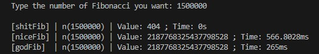

# **Fibonacci Calculator in GoLang**

This is a simple GoLang program that calculates Fibonacci numbers using different approaches. The code contains three functions to calculate Fibonacci numbers: *`shitFibonacci`*, *`niceFibonacci`*, and *`godFibonacci`*. It also measures the time taken for each calculation.

## **How to Use**

1. Ensure you have GoLang installed on your system.
2. Run the following command to execute the program:
   ```bash
   go run main.go
3. Enter the number of Fibonacci numbers you want to calculate when prompted.

## **Functions**

### `shitFibonacci`

This function calculates Fibonacci numbers recursively. However, it's not efficient for large numbers due to its recursive nature. It uses a basic recursive algorithm.

### `niceFibonacci`

This function uses memoization to optimize the Fibonacci calculation. It stores previously calculated Fibonacci numbers in a map to avoid redundant calculations.

### `godFibonacci`
This function also utilizes memoization but employs an iterative approach. It calculates Fibonacci numbers iteratively and stores them in a map for faster access.

## Performance

The program calculates Fibonacci numbers using all three methods and compares the time taken for each approach. It displays the calculated value and the time taken to compute for each method. The comparison helps to understand the performance difference between the approaches.

## Be careful with [Stack Overflow](https://www.techtarget.com/whatis/definition/stack-overflow#:~:text=A%20stack%20overflow%20is%20a,been%20allocated%20to%20that%20stack.)!

# I/O Example
