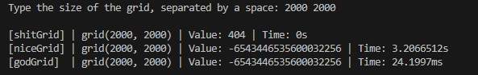

# **Grid Traveler in GoLang**

This is a GoLang program that calculates the number of ways to travel in a grid from the top-left to the bottom-right using different approaches. The code contains three functions to calculate these values: *`shitGridTraveler`*, *`niceGridTraveler`*, and *`godGridTraveler`*. It also measures the time taken for each calculation.

## **How to Use**

1. Ensure you have GoLang installed on your system.
2. Run the following command to execute the program:
   ```bash
   go run main.go
3. Enter the size of the grid (separated by a space) when prompted.

## **Functions**

### `shitGridTraveler`

This function calculates the number of ways to travel in a grid recursively. However, it's not efficient for large grid sizes due to its recursive nature. It uses a basic recursive algorithm.

### `niceGridTraveler`

This function uses memoization to optimize the grid traveler calculation. It stores previously calculated values in a map to avoid redundant calculations, improving efficiency.

### `godGridTraveler`
This function utilizes dynamic programming to efficiently calculate the number of ways to travel in a grid. It fills a 2D grid using an iterative approach, storing the results for each cell to avoid redundant calculations.

## Performance

The program calculates the number of ways to travel in a grid using all three methods and compares the time taken for each approach. It displays the calculated value and the time taken to compute for each method. The comparison helps to understand the performance difference between the approaches.

## Be careful of [Stack Overflow](https://www.techtarget.com/whatis/definition/stack-overflow#:~:text=A%20stack%20overflow%20is%20a,been%20allocated%20to%20that%20stack.)!

# I/O Example
